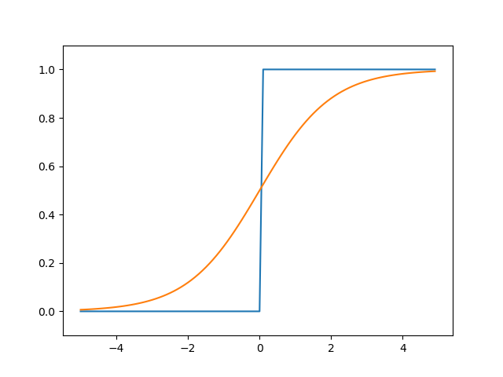

# 퍼셉트론 Perceptron
**1958년 로젠블렛이 퍼셉트론 제안**
* AND
  * w1, w2, theta를 활용하여 구현 👉 theta를 -b로 치환하여 w1, w2, b를 활용하여 구현
* OR
* NAND
  * NAND만 구현하면 AND, OR, XOR를 모두 표현할 수 있기 때문에 중요하다.
* XOR
  * 단층 퍼셉트론으로는 구현이 불가능(1969년 민스키의 퍼셉트론의 과대포장을 지적하여 1987년까지 내리막길)
  * 다층 퍼셉트론을 활용하여 구현 가능(Multi Layer Perceptron, MLP)(1987년)

# 활성화 함수 Activation Function
* step function
* sigmoid function

* ReLU function

